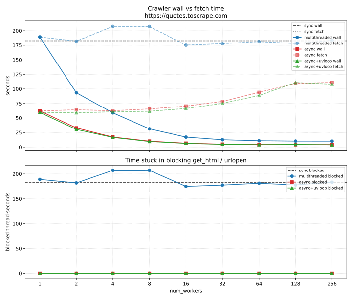

# Crawler comparison

Crawl of `https://quotes.toscrape.com` (215 pages) with the sync, multithreaded, and async implementations.
Worker counts are powers of two from 1 to 256: `1, 2, 4, 8, 16, 32, 64, 128, 256`.

## Metrics

| Metric | Meaning |
|---|---|
| **wall** | Elapsed time for the whole crawl. |
| **fetch** | Sum of per-request durations (I/O wait + HTML parse). Concurrent crawlers overlap these, so fetch stays large while wall drops. |
| **blocked** | Cumulative seconds OS threads spent inside blocking `get_html` / `urlopen`. Async I/O yields the event loop, so this stays 0. |
| **avg blocked** | `blocked / wall` — average number of threads stuck in `urlopen` during the crawl. |

## Sync baseline

| crawler | pages | wall (s) | fetch (s) | blocked (s) | avg blocked | pages/s |
|---|---:|---:|---:|---:|---:|---:|
| sync | 215 | 182.83 | 182.81 | 182.63 | 1.0 | 1.2 |

One thread, so wall ≈ fetch ≈ blocked.

## Multithreaded

| workers | pages | wall (s) | fetch (s) | blocked (s) | avg blocked | pages/s |
|---|---:|---:|---:|---:|---:|---:|
| 1 | 215 | 189.30 | 189.28 | 189.06 | 1.0 | 1.1 |
| 2 | 215 | 93.33 | 182.19 | 182.00 | 2.0 | 2.3 |
| 4 | 215 | 58.81 | 207.50 | 207.29 | 3.5 | 3.7 |
| 8 | 215 | 31.37 | 207.38 | 207.18 | 6.6 | 6.9 |
| 16 | 215 | 17.18 | 175.22 | 175.04 | 10.2 | 12.5 |
| 32 | 215 | 12.61 | 177.83 | 177.65 | 14.1 | 17.1 |
| 64 | 215 | 10.91 | 181.44 | 181.30 | 16.6 | 19.7 |
| 128 | 215 | 10.30 | 178.02 | 177.87 | 17.3 | 20.9 |
| 256 | 215 | 10.19 | 183.56 | 183.40 | 18.0 | 21.1 |

Best wall: **10.19s** at `256` workers
(17.9× vs sync). Blocked time stays near the sync fetch total because every GET still occupies a thread in `urlopen`.

## Async (stdlib event loop)

| workers | pages | wall (s) | fetch (s) | blocked (s) | avg blocked | pages/s |
|---|---:|---:|---:|---:|---:|---:|
| 1 | 215 | 62.20 | 62.18 | 0.00 | 0.0 | 3.5 |
| 2 | 215 | 32.89 | 64.11 | 0.00 | 0.0 | 6.5 |
| 4 | 215 | 17.24 | 62.56 | 0.00 | 0.0 | 12.5 |
| 8 | 215 | 10.19 | 65.57 | 0.00 | 0.0 | 21.1 |
| 16 | 215 | 6.63 | 70.47 | 0.00 | 0.0 | 32.4 |
| 32 | 215 | 4.98 | 78.58 | 0.00 | 0.0 | 43.2 |
| 64 | 215 | 4.30 | 94.00 | 0.00 | 0.0 | 50.0 |
| 128 | 215 | 4.08 | 109.55 | 0.00 | 0.0 | 52.7 |
| 256 | 215 | 4.13 | 111.13 | 0.00 | 0.0 | 52.0 |

Best wall: **4.08s** at `128` workers
(44.9× vs sync). Fetch time is still the sum of in-flight awaits; **blocked stays 0** because `aiohttp` yields instead of parking an OS thread on each GET.

## Async + uvloop

Same crawler, but `asyncio.run(..., loop_factory=uvloop.new_event_loop)` so libuv drives the event loop instead of the stdlib selector.

| workers | pages | wall (s) | fetch (s) | blocked (s) | avg blocked | pages/s |
|---|---:|---:|---:|---:|---:|---:|
| 1 | 215 | 59.54 | 59.51 | 0.00 | 0.0 | 3.6 |
| 2 | 215 | 30.36 | 58.98 | 0.00 | 0.0 | 7.1 |
| 4 | 215 | 16.61 | 60.60 | 0.00 | 0.0 | 12.9 |
| 8 | 215 | 9.58 | 61.59 | 0.00 | 0.0 | 22.5 |
| 16 | 215 | 6.33 | 66.32 | 0.00 | 0.0 | 34.0 |
| 32 | 215 | 4.72 | 75.25 | 0.00 | 0.0 | 45.5 |
| 64 | 215 | 4.08 | 88.64 | 0.00 | 0.0 | 52.7 |
| 128 | 215 | 4.51 | 110.96 | 0.00 | 0.0 | 47.7 |
| 256 | 215 | 3.90 | 108.24 | 0.00 | 0.0 | 55.2 |

Best wall: **3.90s** at `256` workers
(46.9× vs sync, 1.05× vs stdlib asyncio).
Blocked stays 0: uvloop does not change the I/O model, only the loop implementation.

## Reading the plot

- **Wall** falls for both concurrent crawlers until the BFS frontier and the remote host saturate (around 64–128 workers here). Extra workers past that point do not help.
- **Fetch** is total request-seconds of work. For threads it stays near the sync baseline. Async fetch is lower because `aiohttp` reuses a connection pool; it rises again at high concurrency as the host slows down.
- **Blocked** is the difference that async buys you. Threads overlap I/O the same way async does, but they pay for it by sitting in `urlopen`. The event loop does not.
- Async with 1 worker is already faster than sync: that gap is the HTTP client (`aiohttp` vs `urlopen`), not concurrency.
- **uvloop** vs stdlib asyncio is event-loop overhead, not blocking vs non-blocking. On this host-bound crawl the two stay close; uvloop helps more when the loop itself is the bottleneck (many short I/O ops, not one slow website).

Rerun with `uv run python benchmark.py`. Delete `crawler_comparison.json` first to remeasure every crawler.
